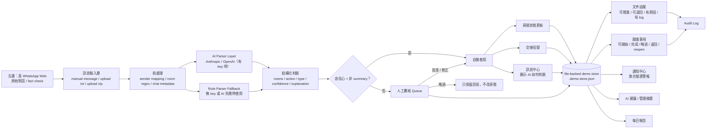

# TOWNPLACE SOHO — Cross-Department Handoff Bridge System

這是一個為 TOWNPLACE SOHO 設計的 **跨部門交接橋樑系統 prototype**。  
它不是要取代 WhatsApp，而是夾在 WhatsApp 與營運流程中間，負責把原始對話轉成：

- 可追蹤的房間狀態
- 跨部門 handoff signal
- 待人工覆核訊息
- 管理層通知與跟進事項

---

## 目前產品定位

這個系統現在最適合這樣使用：

- **左邊：真 WhatsApp Web**
  - 給 manager 即時 fact check 原文
- **中間：訊息中心 / AI reasoning**
  - 顯示系統如何理解 WhatsApp 訊息
- **右邊：交接信號**
  - 顯示真正要處理的跨部門 handoff

換句話說，產品的核心不是「聊天工具」，而是：

**Truth -> Reasoning -> Action**

---

## 這個系統解決什麼問題

目前物業管理日常主要透過 WhatsApp 群組與直聊溝通。  
問題不是「沒有訊息」，而是：

- 訊息很多
- 房號與動作埋在文字裡
- 真正的交接時刻很易被沖走
- 管理層很難即時知道哪個房間卡住
- 同事按了文件 / 跟進狀態後，未必知道誰按、為什麼按、能否退回

這個系統的價值在於：

1. 保留原始 WhatsApp 作證據
2. 用 AI / parser 把訊息結構化
3. 把營運重點變成 signal / review / notification / follow-up
4. 補上 auditability

---

## 現況架構圖



---

## AI-driven 是怎樣做的

目前 parsing 層是 **Hybrid AI**：

### 1. 前處理仍然保留規則

系統先做這些穩定的事情：

- sender -> department mapping
- room regex extraction
- chat metadata normalization
- summary / aggregate 訊息初步識別

### 2. 真 AI parser

如果有設定：

- `ANTHROPIC_API_KEY`
- 或 `OPENAI_API_KEY`

系統會把訊息交給 LLM，要求它回傳 JSON：

- `rooms`
- `action`
- `type`
- `from_dept`
- `to_dept`
- `confidence`
- `explanation`

### 3. 規則 fallback

如果：

- 沒有設定 API key
- 或 AI API timeout / 失敗

系統會自動退回規則 parser，prototype 仍然可用。

### 4. 保守套用

就算有 AI，也不會盲目直接改狀態。

像以下情況仍然會進 review queue：

- 低信心
- summary / bullet list
- 多房多動作混合
- 模糊工程完成訊息

### 5. UI 會顯示 AI reasoning

訊息中心每張卡會顯示：

- 由哪個 parser 判斷
  - Claude AI
  - OpenAI
  - Rule engine
  - Human review
- 信心度
- 判斷原因 explanation

---

## 重要業務規則

這些規則是刻意設計，不是 bug：

### `完成` 不等於 `handoff`

以下只算進度更新，不會直接推去清潔：

- `23D 已完成油漆`
- `31K 已調整大門鉸，回復正常`
- `已處理部分工程`

### 只有明確 `可清 / 可清潔` 才算 handoff

例如：

- `10F 已完成，可清潔`
- `19C完成可清`

才會建立：

- `eng -> clean`

### summary 訊息不直接改狀態

例如：

- `是日跟進`
- 多行 bullet list
- 多房多種 action 混在一起

會先進 `Review Queue`。

---

## 主要功能

### 1. 訊息中心

- 顯示原始文字
- 顯示解析結果
- 顯示 AI explanation
- 顯示 parser 來源與信心度

### 2. 交接信號

- 顯示房間、from/to dept、action、status
- 支援 acknowledge

### 3. 房間看板

- 顯示 engineering / cleaning / lease status
- 顯示 needs attention
- 可由通知上下文帶房號高亮

### 4. 人工覆核

- 低信心與 summary 訊息自動進 queue
- 可批准、修正、略過
- 修正後才套用房態與 handoff

### 5. AI 建議

- 根據房間 / handoff / 文件 / booking / followup 產出管理摘要
- 可一鍵建立 follow-up

### 6. 跟進事項

- `open -> in_progress -> done / dismissed`
- 支援退回與 reopen
- 所有狀態改動必須填 `操作人 + 原因`
- 會留下 audit log

### 7. 文件追蹤

- 文件 pipeline 推進
- 支援退回上一步
- 所有推進 / 退回都要填 `操作人 + 原因`
- 會留下 audit log

### 8. 通知中心

目前已聚合以下警報：

- handoff timeout
- document overdue
- booking conflict
- pending review
- urgent follow-up
- follow-up due
- checkout pending
- cleaning waiting

### 9. 每日報告

- 依據已解析訊息與 handoff 產生「是日跟進」

---

## 技術架構

- **Frontend**：Next.js 14, React 18, TypeScript
- **Styling**：Tailwind CSS
- **UI Icon**：Lucide React
- **Current Storage**：`.demo-store.json`（目前仍是主線唯一儲存實作）
- **AI Parser**：
  - Anthropic Messages API（可選）
  - OpenAI Chat Completions API（可選）
  - Rule parser fallback
- **Policy Engine**：可配置策略引擎（`src/lib/policy/`）— 業務規則、閾值、部門映射全部可外部配置
- **Permissions**：RBAC 權限模型（`src/lib/permissions.ts`）— admin / manager / operator / viewer 四級角色
- **Auth**：認證抽象層（`src/lib/auth.ts`）— 目前為 demo login gate，可替換為 JWT
- **Database Future Work**：`src/lib/storage/` 目前只保留作為未來資料庫遷移草稿，不是現行主線架構
- **Observability**：可觀測性 hook（`src/lib/observability.ts`）— 結構化事件記錄
- **Testing**：Vitest — 235 個測試覆蓋 15 個檔案（parser、ingest、audit、document pipeline、followup、review lifecycle、policy、permissions、notifications、suggestions、store、API validation、handoffs route）

---

## 系統升級亮點

### 測試覆蓋（235 個測試，15 個檔案）
- `tests/parser.test.ts` — 34 個：WhatsApp 訊息解析、部門映射、word boundary 回歸
- `tests/message-parsing.test.ts` — 27 個：房號提取、handoff 信號分析、安全閘門
- `tests/ingest.test.ts` — 36 個：房態更新、summary 偵測、整合流程
- `tests/audit.test.ts` — 7 個：審計日誌建立與查詢
- `tests/document-pipeline.test.ts` — 15 個：文件推進/退回/驗證
- `tests/followup-states.test.ts` — 13 個：跟進事項狀態轉換
- `tests/review-lifecycle.test.ts` — 12 個：覆核批准/修正/衝突偵測
- `tests/policy.test.ts` — 12 個：策略引擎回歸保護 + 自訂策略 + 深度合併
- `tests/permissions.test.ts` — 24 個：RBAC 權限矩陣 + isAuthenticated
- `tests/review-fixes.test.ts` — 5 個：跨模組整合測試
- `tests/notifications.test.ts` — 13 個：handoff timeout、doc overdue、booking conflict、自訂閾值
- `tests/suggestions.test.ts` — 11 個：分析器觸發、notification overlap 抑制
- `tests/store.test.ts` — 8 個：normalizeStore、seed data、持久化、reset
- `tests/api-validation.test.ts` — 8 個：無效 JSON、priority enum、版本衝突
- `tests/handoffs-route.test.ts` — 10 個：轉移矩陣、actor/reason、audit logging、版本遞增

### 策略引擎（`src/lib/policy/`）
業務規則從散落的 parser/ingest/notifications 中抽取到獨立策略層：
- `ActionPatternConfig` — 訊息→動作 匹配規則
- `HandoffPolicy` — 正面/負面/未來語境 regex
- `ReviewPolicy` — 信心閾值、summary/模糊完成 審查策略
- `RoomStatusRule` — 房態更新規則
- `mergePolicy()` — 部分覆蓋預設策略

### 多用戶/多物業資料模型
- 所有實體新增 `property_id` 外鍵（預設 `tp-soho`）
- 所有可變實體新增 `version` 欄位（樂觀鎖定）
- 新增 `Property`、`User`、`UserRole` 類型
- RBAC 權限函式：`canChangeRoomStatus`、`canApproveHandoff`、`canEditDocument` 等

### 生產強化抽象
- **Database 遷移草稿**（`src/lib/storage/`）— 保留作為未來 Postgres/SQL 遷移方向，現階段未接入主線 route/service
- **認證抽象**（`src/lib/auth.ts`）— `AuthProvider` 介面 + `DemoAuthProvider`
- **可觀測性**（`src/lib/observability.ts`）— 結構化事件 hook

---

## 目前不是什麼

這個版本仍然不是：

- 真實 WhatsApp realtime bridge
- 正式多人資料庫（`src/lib/storage/` 仍只是未來資料庫遷移草稿）
- production-ready deployment

它現在是：

**有 235 個測試保護、有策略引擎、有權限模型，並且已把資料庫遷移與設計對照頁面清楚隔離的可展示 prototype。**

---

## 本地運行

### 1. 安裝

```bash
npm install
```

### 2. 設定環境變數

複製：

```bash
cp .env.example .env.local
```

可選設定：

- `SYSTEM_PASSWORD`
- `ANTHROPIC_API_KEY`
- `ANTHROPIC_MODEL`
- `OPENAI_API_KEY`
- `OPENAI_MODEL`

如果沒有 AI key，系統會自動 fallback 到規則 parser。

### 3. 啟動

```bash
npm run dev
```

或：

```bash
npm run build
npm run start
```

---

## Demo 建議方式

最推薦的 demo 方式是：

1. 左邊開真實 WhatsApp Web
2. 右邊開本系統
3. 先展示原文
4. 再展示中間 AI 如何理解
5. 最後展示右邊 handoff / review / followup / documents log

這樣 management 最容易信。

---

## 關鍵檔案

### 核心邏輯

- `/src/lib/parser.ts` — WhatsApp 訊息解析（支援自訂 pattern config）
- `/src/lib/ai/parse-message.ts` — Hybrid AI parser
- `/src/lib/ingest.ts` — 訊息攝入管線 + 房態更新
- `/src/lib/message-parsing.ts` — Handoff 信號分析 + 安全閘門
- `/src/lib/notifications.ts` — 聚合通知引擎
- `/src/lib/suggestions.ts` — AI 建議引擎（8 個分析器）
- `/src/lib/audit.ts` — 審計日誌（欄位級變更追蹤）
- `/src/lib/store.ts` — 併發安全的 JSON store
- `/src/lib/types.ts` — 核心類型定義

### 策略與權限

- `/src/lib/policy/types.ts` — 策略類型定義
- `/src/lib/policy/defaults.ts` — 預設策略值
- `/src/lib/permissions.ts` — RBAC 權限檢查
- `/src/lib/auth.ts` — 認證抽象層
- `/src/lib/storage/` — future database work 草稿（未接入主線）
- `/src/lib/observability.ts` — 可觀測性 hook

### API

- `/src/app/api/messages/route.ts`
- `/src/app/api/upload/route.ts`
- `/src/app/api/parse/route.ts`
- `/src/app/api/reviews/route.ts`
- `/src/app/api/documents/route.ts`
- `/src/app/api/followups/route.ts`

### 主要頁面

- `/src/app/page.tsx`
- `/src/app/reviews/page.tsx`
- `/src/app/documents/page.tsx`
- `/src/app/followups/page.tsx`
- `/src/app/notifications/page.tsx`
- `/src/app/rooms/page.tsx`
- `/src/app/gemini/` — 純設計實驗場，用來比較 Gemini 版前端風格；不會寫入正式資料

### 測試

- `/tests/helpers.ts` — 共用測試工具（`withTempWorkspace`、`jsonRequest`、`isoNow`、`makeRoom`）
- `/tests/parser.test.ts` — 訊息解析 + 部門映射 + word boundary 回歸
- `/tests/message-parsing.test.ts` — 房號提取 + handoff 信號
- `/tests/ingest.test.ts` — 攝入管線 + 房態更新
- `/tests/audit.test.ts` — 審計日誌
- `/tests/document-pipeline.test.ts` — 文件 pipeline
- `/tests/followup-states.test.ts` — 跟進事項狀態
- `/tests/review-lifecycle.test.ts` — 覆核生命週期
- `/tests/policy.test.ts` — 策略引擎
- `/tests/permissions.test.ts` — RBAC 權限 + isAuthenticated
- `/tests/review-fixes.test.ts` — 跨模組整合測試
- `/tests/notifications.test.ts` — 通知引擎（handoff timeout、doc overdue 等）
- `/tests/suggestions.test.ts` — 建議引擎（overlap 抑制）
- `/tests/store.test.ts` — Store 持久化與正規化
- `/tests/api-validation.test.ts` — API 輸入驗證
- `/tests/handoffs-route.test.ts` — Handoffs 路由加固

### 文件

- `/docs/ARCHITECTURE.md` — 系統架構總覽
- `/docs/POLICY_ENGINE.md` — 策略引擎使用指南
- `/docs/PRODUCTION_HARDENING.md` — 生產強化路線圖

---

## 已知限制

- `.demo-store.json` 不適合多人同時寫入；`src/lib/storage/` 目前只是 future work 草稿，尚未提供真正資料庫交易能力
- auth 仍是 demo gate，不是真正 user identity（已有 `AuthProvider` 抽象，可替換為 JWT）
- documents / followups 的 `操作人` 目前是頁面輸入欄，不是正式登入身份
- notifications 雖已聚合，但仍未是 persisted alert lifecycle
- RBAC 權限模型已定義，但尚未在 API routes 中強制執行

---

## 補充文件

- `/docs/ARCHITECTURE.md` — 系統架構、數據流、模組依賴
- `/docs/POLICY_ENGINE.md` — 策略引擎使用說明（新增規則/部門/閾值）
- `/docs/PRODUCTION_HARDENING.md` — 生產強化路線圖（儲存遷移、併發、認證、隱私、可觀測性）
- `/docs/CODEX_SESSION_HANDOFF_2026-03-10.md` — 開發交接文件
