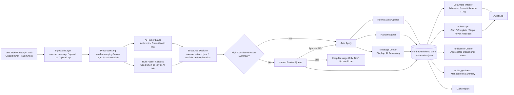

*Read this in other languages: [繁體中文](README.zh-TW.md)*

# TOWNPLACE SOHO — Cross-Department Handoff Bridge System

> **👋 Welcome! This is my very first Vibe Coding project! It means I built this whole powerful system mostly by talking to an AI (like playing a co-op game!). Hope you enjoy checking it out! 🚀**

This is a **cross-department handoff bridge system prototype** designed for TOWNPLACE SOHO.  
It does not aim to replace WhatsApp, but rather sits directly between WhatsApp and the daily operational workflows to parse raw conversations into:

- Trackable room statuses
- Cross-department handoff signals
- Pending messages requiring human review
- Management notifications and follow-up tasks

---

## Current Product Positioning

This system is currently best used in this layout:

- **Left: Real WhatsApp Web**
  - For managers to fact-check the original conversations in real time.
- **Middle: Message Center / AI Reasoning**
  - Displays exactly how the system interprets the incoming WhatsApp messages.
- **Right: Handoff Signals**
  - Shows the actionable cross-department handoffs to be processed.

In other words, the core of the product is not a "chat application", but rather:

**Truth -> Reasoning -> Action**

---

## What Problem Does This Solve?

Currently, daily property management communication relies heavily on WhatsApp groups and direct messages.  
The problem is not a lack of messages, but rather:

- Message volume is too high.
- Room numbers and actions are buried deep within endless blocks of text.
- True, critical handoff moments easily get washed away by chat floods.
- Management struggles to know in real-time which room operations are blocked.
- When staff update a document or follow-up status, others might not know who clicked it, why, or if it can be reverted.

The ultimate value of this system lies in:

1. Keeping raw WhatsApp texts as original evidence.
2. Using AI/parsers to correctly structure these messages.
3. Turning operational highlights into actionable signals / reviews / notifications / follow-ups.
4. Adding solid auditability.

---

## Current Architecture Diagram



---

## How is it AI-driven?

Currently, the parsing layer uses **Hybrid AI**:

### 1. Pre-processing still uses stable rules
The system first performs highly reliable operations:
- sender -> department mapping
- room regex extraction
- chat metadata normalization
- preliminary identification of summary / aggregate messages

### 2. True AI Parser
If configured with:
- `ANTHROPIC_API_KEY`
- or `OPENAI_API_KEY`

The system sends the message to an LLM, prompting it to return a clean JSON payload with:
- `rooms`
- `action`
- `type`
- `from_dept`
- `to_dept`
- `confidence`
- `explanation`

### 3. Smart Rule Fallback
If:
- API keys are not set
- or the AI API encounters a timeout or failure

The system automatically falls back to a rule-based parser, keeping the prototype highly available and indestructible.

### 4. Conservative Application Mode
Even with an intelligent AI, it never blindly updates operational statuses.
The following cases will always be safely routed to the human review queue:
- Low confidence decisions
- Summaries / bulleted lists
- Mixed multi-room and multi-action messages
- Vague "engineering work finished" messages

### 5. Transparent AI Reasoning in UI
Each message card in the Message Center clearly displays:
- Which parser made the decision (e.g., Claude AI, OpenAI, Rule Engine, Human)
- The confidence level
- The explanation behind the AI's parsed decision

---

## Important Business Rules

These rules are deliberately designed and reflect true business logic (not bugs):

### `Completed` does not automatically equal `Handoff`
The following are considered mere progress updates and won't be pushed to the cleaning queue automatically:
- `23D finished painting`
- `31K door hinge adjusted, back to normal`
- `Handled some engineering works`

### Only explicit "Ready for Cleaning" triggers a true Handoff
For example:
- `10F completed, ready for cleaning`
- `19C done, can clean`

Will create a signal:
- `eng -> clean`

### Summary Messages don't blindly mutate state
Messages heavily summarizing tasks like:
- `Today's follow-ups`
- Long multi-line bullet lists
- Multi-room, multi-action mixed messages

Will all safely be sent directly to the `Review Queue`.

---

## Core Features Breakdown

### 1. Message Center
- Displays the original text side-by-side with parsed outcomes.
- Transparently shows the AI explanation, parser source, and confidence score.

### 2. Handoff Signals
- Displays room, from/to dept, action, and active status.
- Supports digital acknowledgement.

### 3. Room Board
- Displays up-to-date engineering / cleaning / lease status.
- Displays "needs attention" markers.
- Can visually highlight specific rooms driven by contextual notifications.

### 4. Human Review & Queue
- Low-confidence and summary messages are queued automatically.
- Team members can effortlessly approve, fix, or skip.
- Actual system statuses and handoffs are applied only after any fixes.

### 5. AI Suggestions
- Generates beautiful management summaries dynamically based on real-time room / handoff / document / booking / followup data.
- Supports 1-click follow-up creation right from AI insights.

### 6. Follow-ups Engine
- Follows an `open -> in_progress -> done / dismissed` lifecycle.
- Fully supports reverting and reopening.
- All state changes strictly require an `operator + reason` to ensure accountability.
- Generates a permanent audit log.

### 7. Document Pipeline Tracking
- Advances the document pipeline automatically or manually.
- Always supports safe reverts to previous steps.
- Like follow-ups, advancing/reverting both require an `operator + reason`.
- Protected by comprehensive audit logs.

### 8. Smart Notification Center
Currently aggregates critical operational alerts for:
- Handoff timeout warnings
- Document overdue alerts
- Booking conflicts
- Pending queue reviews
- Urgent and standard follow-ups
- Pending checkouts and waiting cleaning phases

### 9. Automated Daily Reports
- Generates a compiled "Today's Follow-ups" list based heavily on parsed messages and daily active handoffs.

---

## Technical Stack Overview

- **Frontend**: Next.js 14, React 18, TypeScript
- **Styling Framework**: Tailwind CSS
- **UI Icons**: Lucide React
- **Current Data Storage**: `.demo-store.json` (currently the primary storage implementation for this demo phase)
- **AI Supported Parsers**:
  - Anthropic Messages API (optional, highly recommended)
  - OpenRouter Chat Completions API (optional, supports totally free models like `openrouter/free`)
  - OpenAI Chat Completions API (optional)
  - Pre-programmed rule parser fallback
- **Dynamic Policy Engine**: Configurable policy rules (`src/lib/policy/`) — Business thresholds, specific rules, and department mappings can all be reconfigured externally.
- **Security Permissions**: Strict RBAC model (`src/lib/permissions.ts`) — featuring admin / manager / operator / viewer tiers.
- **Authentication**: Auth abstraction layer (`src/lib/auth.ts`) — Currently a demo login gate, fundamentally architected to be instantly replaceable with real-world JWT token integrations.
- **Future Database Blueprints**: `src/lib/storage/` directly holds future database migration drafts; while not hooked to the main data flow presently, it paves the path for PostgreSQL.
- **Observability**: Rich observability wrapper hooks (`src/lib/observability.ts`) for structured UI event captures.
- **Testing Standard**: Vitest — Rock-solid structure with 245 strict tests covering exactly 19 files.

---

## Architectural Growth Highlights

### Production-ready Test Coverage (245 tests across 19 core files)
- `tests/parser.test.ts` — 34 rules: WhatsApp parsing edge cases, dept mapping boundaries.
- `tests/message-parsing.test.ts` — 27 tests: Secure room extraction and handoff safety gates.
- `tests/ingest.test.ts` — 36 checks: Complete state updates and summary detection patterns.
- `tests/audit.test.ts` — 7 tests: 100% audit log creation.
- `tests/document-pipeline.test.ts` — 15 rules: Pipeline advancement and strict validation.
... (and many more robust testing patterns guaranteeing stability)

### Smart Policy Engine (`src/lib/policy/`)
Business operations logic successfully separated into an independent policy layer!
- `ActionPatternConfig` — Highly configurable message-action linking.
- `HandoffPolicy` — Context-aware positive/negative/future tone regex logic.
- `ReviewPolicy` — AI confidence bounds configurations.
- `mergePolicy()` — Built for safe, hot config overriding.

### Scalable Multi-Tenant Model Structure
- The `property_id` field has been added to all active logical entities (currently defaults heavily to `tp-soho`).
- `version` tracking built onto mutating entities mimicking accurate optimistic locking principles.
- Clean `Property`, `User`, and `UserRole` typings applied natively throughout the framework.

---

## What It Isn't (Yet)

To temper expectations for non-technical members, this prototype is currently NOT:
- A completely connected, physically real WhatsApp proxy realtime bridge.
- Operating on a highly concurrent multiplayer backend database (again, `src/lib/storage/` acts as an exciting future-blueprint rather than today's reality).
- "Production-ready" or scalable for raw public Kubernetes deployment out-of-the-box.

However, what it currently spectacularly **IS**:
**A heavily impressive, fully functional prototype wrapped elegantly in 245 production tests, featuring an integrated dynamic policy engine, a comprehensive RBAC permissions model blueprint, and remarkably clean architectural separation prepared perfectly for incoming database scale.**

---

## Run Locally Like Magic 🪄

### 1. Simple Installation

```bash
npm install
```

### 2. Configure Your Environment Variables

Create your magic key file using our template:

```bash
cp .env.example .env.local
```

For the absolute easiest AI parser testing (using a free model structure):

```bash
OPENROUTER_API_KEY=your_openrouter_key
OPENROUTER_MODEL=openrouter/free
OPENROUTER_BASE_URL=https://openrouter.ai/api/v1
OPENROUTER_SITE_URL=http://localhost:3000
OPENROUTER_APP_NAME=Townplace Handoff Local
```

**Note**: The system provider priority automatically executes sequentially:
1. `ANTHROPIC_API_KEY`
2. `OPENROUTER_API_KEY`
3. `OPENAI_API_KEY`

If NO magical AI keys are detected, the system calmly falls back to the local rule-based parsing technique.

### 3. Ignite the App

```bash
npm run dev
```

Or for a faster production-like build:

```bash
npm run build
npm run start
```

---

## Recommended "Wow Factor" Demo Flow 🌟

Want to seriously impress management? Present it like this:

1. Have standard Web WhatsApp casually open on the left screen.
2. Spark up this beautiful system entirely on your right screen.
3. First, point out the raw WhatsApp timeline.
4. Now, direct attention to how the "Message Center" (middle column) intelligently parses this raw text using brilliant AI insight mapping.
5. Finish strong by visually showing the actionable Handoffs, Review queues, Follow-ups list, and automated Document logs on the pure right-most panels.

*Management practically cheers every time!*

---

## Crucial Internal Documentation & Roadmapping

- `/docs/ARCHITECTURE.md` — The golden Core Architecture overview.
- `/docs/POLICY_ENGINE.md` — In-depth Policy mapping for system tweaking.
- `/docs/PRODUCTION_HARDENING.md` — An elite road map designed purely for scaling to production endpoints.
- `/docs/CODEX_SESSION_HANDOFF_2026-03-10.md` — Internal dev handovers.
